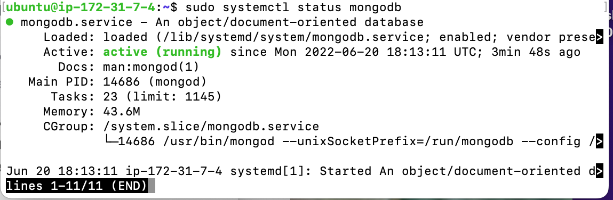
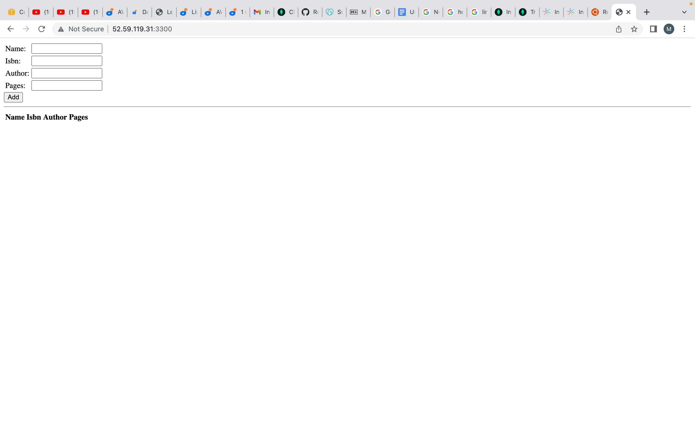

# MEAN STACK IMPLEMENTATION

- The purpose of this project is to implement a simple Book Register web form using MEAN stack.

- Update ubuntu

```
sudo apt  update
```

- Upgrade ubuntu

```
sudo apt upgrade
```

- Add certificates

```
sudo apt -y install curl dirmngr apt-transport-https lsb-release ca-certificates

curl -sL https://deb.nodesource.com/setup_12.x | sudo -E bash -
```

- Installed NodeJS

```
sudo apt install -y nodejs

```

### MongoDB Installation

    *To begin the installation process for MongoDB, had to import the Public key leveraged by the Package Management system associated with my Ubuntu installation.*

```
sudo apt-key adv --keyserver hkp://keyserver.ubuntu.com:80 --recv 0C49F3730359A14518585931BC711F9BA15703C6
```

- Created the Source list for the MongoDB installation.

```
echo "deb [ arch=amd64 ] https://repo.mongodb.org/apt/ubuntu trusty/mongodb-org/3.4 multiverse" | sudo tee /etc/apt/sources.list.d/mongodb-org-3.4.list
```

- Install MongoDB 

```
sudo apt install -y mongodb
```

- Started the server

```
sudo service mongodb start
```

-  To  ensure the service is up and running

```
sudo systemctl status mongodb
```



*The image above shows that MongoDB service is up and running*

- Installed npm – Node package manager.

```
sudo apt install -y npm
```

- Installed body-parser package

```
sudo npm install body-parser
```
 *body-parser package was installed to help process JSON files passed in requests to the server.*

- Created a folder name Books then moved into it

```
mkdir Books && cd Books
```

- In the Books directory, Initialized npm project
```
npm init
```

- Added a file to it named server.js
```
vi server.js
```
Copied and pasted the web server code below into the server.js file.

```
var express = require('express');
var bodyParser = require('body-parser');
var app = express();
app.use(express.static(__dirname + '/public'));
app.use(bodyParser.json());
require('./apps/routes')(app);
app.set('port', 3300);
app.listen(app.get('port'), function() {
    console.log('Server up: http://localhost:' + app.get('port'));
});

```

### Express installation  and routes set up to the server

- Installed Express and set up routes to the server

```
sudo npm install express mongoose
```
*used Mongoose package which provides a straight-forward, schema-based solution to model the application data.*

In ‘Books’ folder, created a folder named apps

```
mkdir apps && cd apps
```

- Created a file named routes.js

```
vi routes.js
```

-  Copied and pasted the code below into routes.js

```
var Book = require('./models/book');
module.exports = function(app) {
  app.get('/book', function(req, res) {
    Book.find({}, function(err, result) {
      if ( err ) throw err;
      res.json(result);
    });
  }); 
  app.post('/book', function(req, res) {
    var book = new Book( {
      name:req.body.name,
      isbn:req.body.isbn,
      author:req.body.author,
      pages:req.body.pages
    });
    book.save(function(err, result) {
      if ( err ) throw err;
      res.json( {
        message:"Successfully added book",
        book:result
      });
    });
  });
  app.delete("/book/:isbn", function(req, res) {
    Book.findOneAndRemove(req.query, function(err, result) {
      if ( err ) throw err;
      res.json( {
        message: "Successfully deleted the book",
        book: result
      });
    });
  });
  var path = require('path');
  app.get('*', function(req, res) {
    res.sendfile(path.join(__dirname + '/public', 'index.html'));
  });
};
```

In the ‘apps’ folder, created a folder named models

```
mkdir models && cd models
```

- Created a file named book.js

```
vi book.js
```

- Copied and pasted the code below into ‘book.js’

```
var mongoose = require('mongoose');
var dbHost = 'mongodb://localhost:27017/test';
mongoose.connect(dbHost);
mongoose.connection;
mongoose.set('debug', true);
var bookSchema = mongoose.Schema( {
  name: String,
  isbn: {type: String, index: true},
  author: String,
  pages: Number
});
var Book = mongoose.model('Book', bookSchema);
module.exports = mongoose.model('Book', bookSchema);
```

### accessing the routes with AngularJS

- Changed the directory back to ‘Books’

```
cd ../..
```

- Created a folder named public

```
mkdir public && cd public
```

- Added  a file named script.js

```
vi script.js
```

- Copied and pasted the Code below (controller configuration defined) into the script.js file.

```
var app = angular.module('myApp', []);
app.controller('myCtrl', function($scope, $http) {
  $http( {
    method: 'GET',
    url: '/book'
  }).then(function successCallback(response) {
    $scope.books = response.data;
  }, function errorCallback(response) {
    console.log('Error: ' + response);
  });
  $scope.del_book = function(book) {
    $http( {
      method: 'DELETE',
      url: '/book/:isbn',
      params: {'isbn': book.isbn}
    }).then(function successCallback(response) {
      console.log(response);
    }, function errorCallback(response) {
      console.log('Error: ' + response);
    });
  };
  $scope.add_book = function() {
    var body = '{ "name": "' + $scope.Name + 
    '", "isbn": "' + $scope.Isbn +
    '", "author": "' + $scope.Author + 
    '", "pages": "' + $scope.Pages + '" }';
    $http({
      method: 'POST',
      url: '/book',
      data: body
    }).then(function successCallback(response) {
      console.log(response);
    }, function errorCallback(response) {
      console.log('Error: ' + response);
    });
  };
});
```

- In public folder, created a file named index.html;

```
vi index.html
```

- Copied and pasted the code below into index.html file.

```
<!doctype html>
<html ng-app="myApp" ng-controller="myCtrl">
  <head>
    <script src="https://ajax.googleapis.com/ajax/libs/angularjs/1.6.4/angular.min.js"></script>
    <script src="script.js"></script>
  </head>
  <body>
    <div>
      <table>
        <tr>
          <td>Name:</td>
          <td><input type="text" ng-model="Name"></td>
        </tr>
        <tr>
          <td>Isbn:</td>
          <td><input type="text" ng-model="Isbn"></td>
        </tr>
        <tr>
          <td>Author:</td>
          <td><input type="text" ng-model="Author"></td>
        </tr>
        <tr>
          <td>Pages:</td>
          <td><input type="number" ng-model="Pages"></td>
        </tr>
      </table>
      <button ng-click="add_book()">Add</button>
    </div>
    <hr>
    <div>
      <table>
        <tr>
          <th>Name</th>
          <th>Isbn</th>
          <th>Author</th>
          <th>Pages</th>

        </tr>
        <tr ng-repeat="book in books">
          <td>{{book.name}}</td>
          <td>{{book.isbn}}</td>
          <td>{{book.author}}</td>
          <td>{{book.pages}}</td>

          <td><input type="button" value="Delete" data-ng-click="del_book(book)"></td>
        </tr>
      </table>
    </div>
  </body>
</html>
```

- Changed the directory back up to Books

```
cd ..
```

- Started the server by running this command:

```
node server.js
```

- Launched another SSH console to test what curl command returns locally.

```
curl -s http://localhost:3300
```

- To be able to access it from the internet, opened port  3300 in my AWS Web Console EC2 Instance.

- Then accessed it from a browser using the Public IP address. The result is shown below

